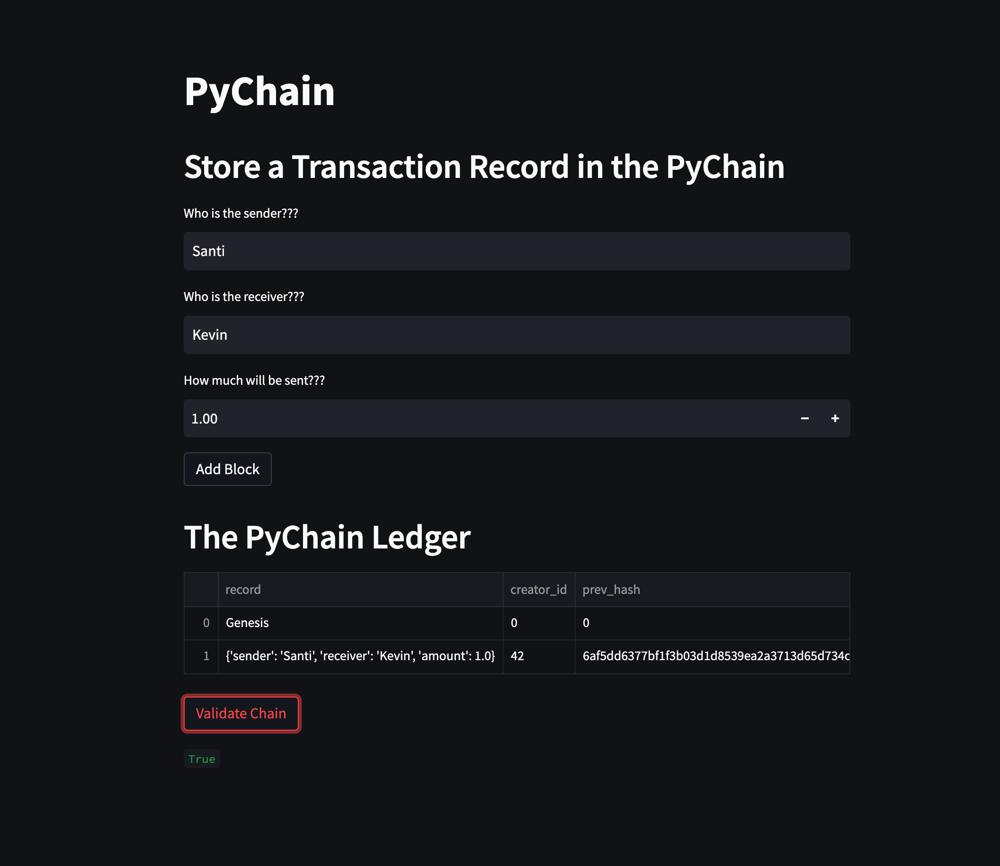
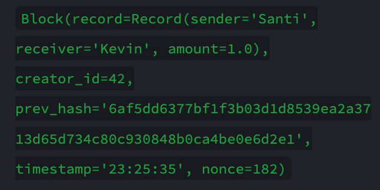

# User Friendly Ledger

>A user friendly ledger demonstration using a Streamlit web application
* [What does the applicaiton look like???](#the-application)
* [What does a block look like???](#viewing-blocks)

---

## Technologies

Python version 3.9 
* [pandas](https://pandas.pydata.org/)
* [streamlit](https://streamlit.io/)

---

## Installation Guide

```python
pip install pandas
pip install streamlit
```

---

## The Application



The application takes in three inputs of the sender, receiver, and how much is being recieved. The block including this data can be veiwed and validated at the bottom of the page.

---

## Viewing Blocks



You can also view blocks on the left side of the page under a dropdown menu including the blockchain.

---

## Contributors

Main contributer **Santiago Hernandez**
- [dsmannight@gmail.com](dsmannight@gmail.com)

---

## License

This application is free for non-profit use.
